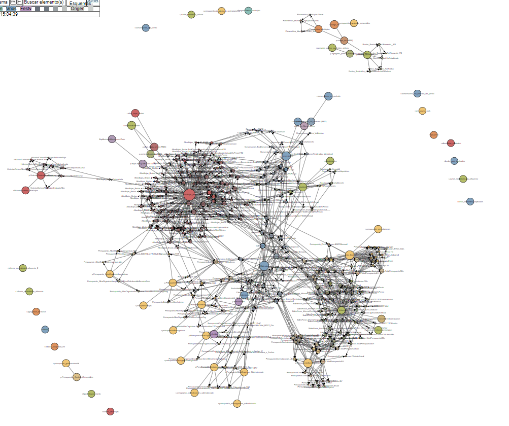

# Readme

## 1. Index

<!-- vscode-markdown-toc -->
[1. Index](#1-index) 
[2. About The Project](#2-about-the-project) 
[3. Usage](#3-usage) 
[4. Contributing](#4-contributing) 
[5. License](#5-license) 
[6. Contact](#6-contact) 

<!-- vscode-markdown-toc-config
	numbering=true
	autoSave=true
	/vscode-markdown-toc-config -->
<!-- /vscode-markdown-toc -->

![Contributors][contributors-shield]
[![Stargazers][stars-shield]][stars-url]
[![LinkedIn][linkedin-shield]][linkedin-url]

## 2. About The Project

<table>
D3.JS graph analytics tool

  <tbody><tr><td>
    
  </td><td>
    

      <i>A serverless HTML + vanilla JS repo to analyze 
      graph data relationships within JS variables. 
      Built with <a href="https://d3js.org/">D3.JS</a> and <a href="https://jquery.com">JQuery</a>. 
      No server required.</i> 
      <a
        href="https://github.com/stars/jgonzal1/lists/starred-by-jgonzal1"
      >Explore my repos</a> | <a
        href="https://github.com/jgonzal1/elocasodelflogisto"
      >View Demo</a> | <a
        href="https://github.com/jgonzal1"
      >Request Feature</a>

</td></tr></tbody></table>

<!---->

## 3. Usage

The repo comes with existing examples, just open `index.html` on your browser.

To modify the data, you can either do it within the current variable names and modify `graph` prefix JS files, or customize the logic appropriately.

## 4. Contributing

Contributions are what make the open source community such an amazing place to be learn, inspire, and create. Any contributions you make are **greatly appreciated**.

1. Fork the Project
2. Create your Feature Branch (`git checkout -b feature/AmazingFeature`)
3. Commit your Changes (`git commit -m 'Add some AmazingFeature'`)
4. Push to the Branch (`git push origin feature/AmazingFeature`)
5. Open a Pull Request
<!---->
## 5. License

Creative Commons non-commercial BY.
See `LICENSE` for more information.

<!---->
## 6. Contact

Javier - [@JaviGonBer](https://twitter.com/JaviGonBer/)

Project Link: [github.com/jgonzal1](https://github.com/jgonzal1)
<!---->

<!-- MARKDOWN LINKS & IMAGES -->
<!-- https://www.markdownguide.org/basic-syntax/#reference-style-links -->
[contributors-shield]: https://img.shields.io/badge/CONTRIBUTORS-1-green?style=for-the-badge
[stars-shield]: https://img.shields.io/badge/STARS-1-informational?style=for-the-badge
[stars-url]: https://github.com/jgonzal1/elocasodelflogisto
[linkedin-shield]: https://img.shields.io/badge/-LinkedIn-black.svg?style=for-the-badge&logo=linkedin&colorB=555
[linkedin-url]: https://linkedin.com/in/javigbe
